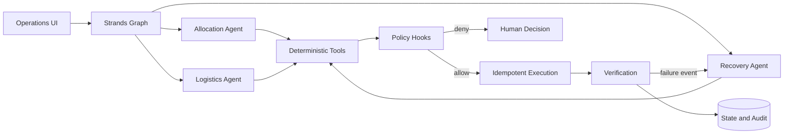
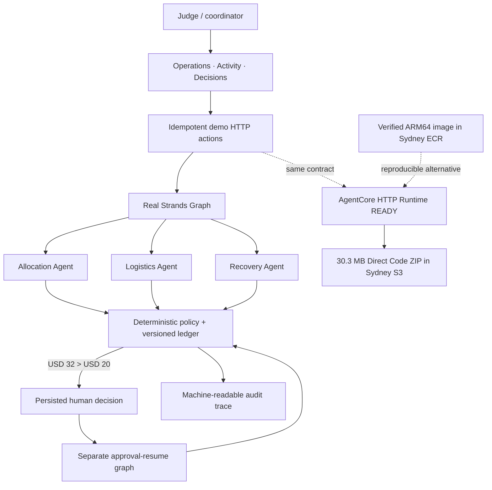

# Architecture

## Runtime flow



## Judge-facing vertical slice



The local judge UI and AgentCore adapter call the same bounded incident
contract. A cloud deployment changes the hosting boundary, not the safety
semantics.

## Boundary that matters

Agents propose plans in an uncertain space. Deterministic code validates and executes state changes. This prevents a plausible-sounding model response from becoming an unsafe action.

## Implemented deterministic contract

- `Donation` contains independently constrained `FoodLot` records.
- `validate_plan` checks the complete proposed plan for inventory, capacity,
  demand, cold-chain, time, version, budget, and operation-key invariants.
- `InMemoryReservationLedger` is the executable reference for atomic
  compare-and-swap and persisted idempotency-result behavior.
- Versioned capacity events expose overcommitment without silently mutating the
  active plan.
- Recovery preserves valid work and patches only the invalid quantity.
- A task enters `PENDING_DECISION` and ends the run when a proposal crosses the
  autonomous budget; approval resumes through a new versioned transition.

The in-memory ledger is not the production datastore. DynamoDB conditional
transactions must preserve the same contract in the AWS vertical slice.

## Implemented Strands vertical slice

The local integration uses the real Strands Agents 1.52 SDK and `GraphBuilder`:

```text
incident invocation
  Allocation Agent -> Logistics Agent -> Recovery Agent
                                      -> PENDING_DECISION (run ends)

approval-resume invocation
  Recovery Resume Agent -> policy validates persisted decision -> atomic commit
```

Each agent can call only its narrow deterministic tool. The offline frozen model
is an integration fixture that deterministically exercises the Strands agent
loop; it is not presented as Bedrock inference. A prompt that asks the agent to
bypass budget policy still terminates at `PENDING_DECISION`.

The canonical machine-readable local trace is
[`evals/reports/strands_capacity_drop_reference.json`](evals/reports/strands_capacity_drop_reference.json).

## AWS footprint

- Implemented: Sydney ECR repository and a single-manifest `linux/arm64` image.
- Implemented: 30.3 MB Linux ARM64-compatible Direct Code ZIP in a private Sydney S3 bucket.
- Implemented: least-privilege AgentCore execution role for ECR, the single S3 deployment prefix, and Runtime logs.
- Implemented: AgentCore HTTP adapter with `/ping` and `/invocations` through the official SDK.
- Implemented: Python 3.12 AgentCore Runtime version 1 is `READY` with MMDSv2 required.
- Implemented: a real `DEFAULT` endpoint invocation returned HTTP 200 and CloudWatch recorded successful completion in 0.018 seconds; the sanitized response and complete tool trace are committed as evaluation evidence.
- Not claimed: production DynamoDB persistence, physical delivery verification, or stochastic Bedrock model quality.

The deployment stays in one region and uses the minimum services needed for a
reproducible demo.

## Agent contracts

| Agent | Input | Output | Bounded failure |
|---|---|---|---|
| Allocation | Donation and organization state | `AllocationPlan` | Cannot mutate state |
| Logistics | Allocation plan, volunteers, time windows | `DeliveryPlan` | Cannot raise budget |
| Recovery | Execution state and failure event | `PatchPlan` | Maximum three replans |
