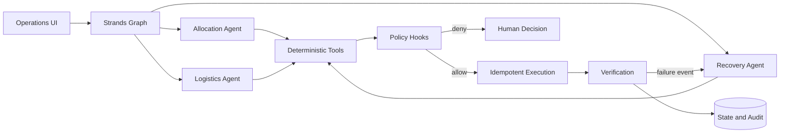

# Architecture

## Runtime flow

## Boundary that matters

Agents propose plans in an uncertain space. Deterministic code validates and executes state changes. This prevents a plausible-sounding model response from becoming an unsafe action.

## Implemented deterministic contract

- `Donation` contains independently constrained `FoodLot` records.
- `validate_plan` checks the complete proposed plan for inventory, capacity,
  demand, cold-chain, time, version, budget, and operation-key invariants.
- `InMemoryReservationLedger` is the executable reference for atomic
  compare-and-swap and persisted idempotency-result behavior.
- Versioned capacity events expose overcommitment without silently mutating the
  active plan.
- Recovery preserves valid work and patches only the invalid quantity.
- A task enters `PENDING_DECISION` and ends the run when a proposal crosses the
  autonomous budget; approval resumes through a new versioned transition.

The in-memory ledger is not the production datastore. DynamoDB conditional
transactions must preserve the same contract in the AWS vertical slice.

## Planned AWS footprint

- Amazon Bedrock for model inference.
- Bedrock AgentCore Runtime for deployable agent execution and technical-evidence depth.
- DynamoDB for task state, idempotency records, and decisions.
- S3 for synthetic datasets and evaluation reports.
- CloudWatch for structured logs and run-level metrics.

The first deployment should use one region and the minimum number of services needed for a reproducible demo.

## Agent contracts

| Agent | Input | Output | Bounded failure |
|---|---|---|---|
| Allocation | Donation and organization state | `AllocationPlan` | Cannot mutate state |
| Logistics | Allocation plan, volunteers, time windows | `DeliveryPlan` | Cannot raise budget |
| Recovery | Execution state and failure event | `PatchPlan` | Maximum three replans |
